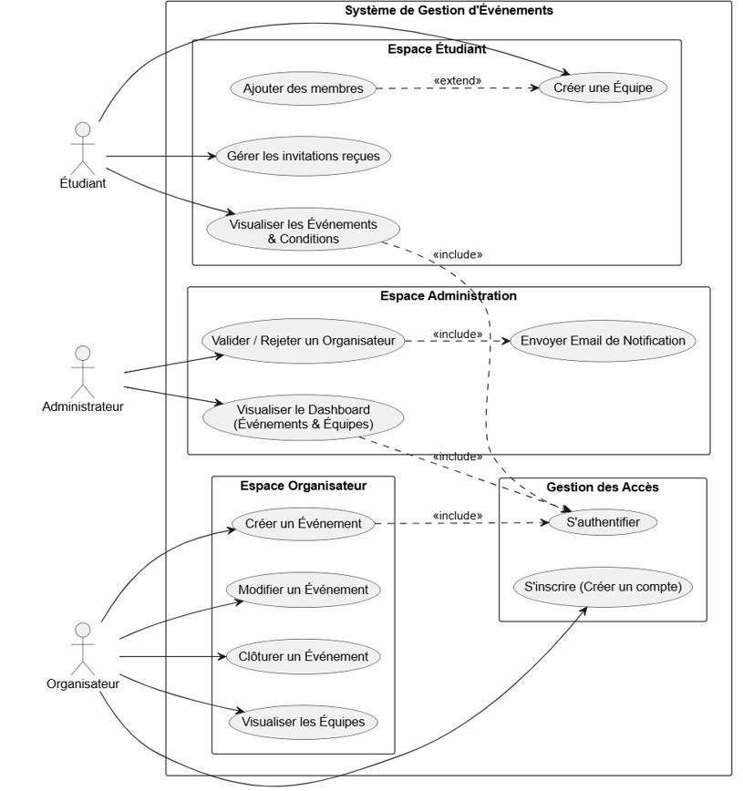

# CollabYouth 

> A modern web platform connecting students with collaborative opportunities — hackathons, challenges, and team formation.

---

## Table of Contents

- [Project Overview](#project-overview)
- [Key Features](#key-features)
- [DevOps Infrastructure](#devops-infrastructure)
   - [CI/CD Pipeline](#cicd-pipeline)
   - [Containerization & Orchestration](#containerization--orchestration)
   - [Observability & Monitoring](#observability--monitoring)
   - [Infrastructure as Code](#infrastructure-as-code)
   - [Zero-Downtime Deployment](#zero-downtime-deployment)
- [Technology Stack](#technology-stack)
- [System Architecture](#system-architecture)
- [Platform Use Cases](#platform-use-cases)
- [Security Features](#security-features)
- [Getting Started](#getting-started)
- [API Documentation](#api-documentation)
- [Testing](#testing)
- [Contributors](#contributors)

---

## Project Overview

CollabYouth is an interactive web platform designed for students who want to collaborate on real projects. It enables users to build a profile showcasing their skills, find the right teammates, join collaborative events like hackathons and challenges, and form teams — all in a modern, student-friendly environment.


The platform supports three types of actors:

**Student** — The core user of the platform. Can register, build a profile with skills and availability, search for partners, send and receive team invitations, and join events.

**Organizer** — Responsible for creating and managing events. Can publish hackathons or challenges with full details and manage participant registrations.

**Admin** — Supervises the entire platform. Manages user accounts, moderates content, and monitors general usage statistics.

---

## Key Features

### Student Features
- Secure registration and login with JWT authentication
- Personal profile creation with skills and availability
- Student search by skill or domain
- Team formation via invitation system
- Event discovery and participation


### Organizer Features
- Event creation with full details (type, dates, description, requirements)
- Participant management and registration tracking

### Admin Features
- User account management
- Content moderation
- Platform usage statistics

---

## DevOps Infrastructure

CollabYouth leverages a complete DevOps pipeline, from code push to live deployment on Kubernetes, with full monitoring and alerting.

### CI/CD Pipeline

The GitHub Actions pipeline automates the entire delivery process across 5 jobs:

```
Push to main
    ├── Job 1: Build & Test Backend  (Java 21 · Maven · JUnit)
    ├── Job 2: Build & Test Frontend (Node 20 · npm · Jest)
    │
    ├── Job 3: Docker Build & Push Backend Image  (needs Job 1)
    ├── Job 4: Docker Build & Push Frontend Image (needs Job 2)
    │
    └── Job 5: Deploy to Minikube via self-hosted runner (needs Jobs 3 & 4)
```


Key pipeline features:
- Backend JAR is built once and reused in the Docker build step (no Maven re-run)
- Docker layer caching via GitHub Actions cache (`type=gha`)
- `NEXT_PUBLIC_API_URL` injected at Docker build time as a build argument
- Images tagged with both `:latest` and `:git-sha` for traceability
- Self-hosted Windows runner handles Kubernetes deployment on a local Minikube cluster

---

### Containerization & Orchestration

CollabYouth is fully containerized and deployed on Kubernetes (Minikube).


#### Running Pods

| Namespace | Service | Description |
|-----------|---------|-------------|
| `default` | `backend-deployment` | Spring Boot API |
| `default` | `frontend-deployment` | Next.js frontend |
| `monitoring` | `prometheus` | Metrics collection |
| `monitoring` | `grafana` | Metrics visualization |
| `monitoring` | `alertmanager` | Alert routing |

#### Kubernetes Resources

- **Deployments** — manage application replicas with rolling update strategy
- **Services** — `LoadBalancer` type for both frontend and backend
- **Secrets** — all sensitive credentials (DB, JWT, mail) stored as Kubernetes secrets
- **ConfigMaps** — Grafana alerting configuration
- **ServiceMonitor** — Prometheus scraping configuration for the backend
- **Resource Limits** — CPU and memory requests/limits on all pods

#### Resource Allocation

| Service | CPU Request | CPU Limit | Memory Request | Memory Limit |
|---------|------------|-----------|----------------|--------------|
| Backend | 250m | 500m | 256Mi | 512Mi |
| Frontend | 100m | 250m | 128Mi | 256Mi |

---

### Observability & Monitoring

CollabYouth includes a full monitoring stack using the `kube-prometheus-stack` Helm chart.


#### Stack Components

- **Prometheus** — scrapes metrics every 15 seconds from all pods and Kubernetes components
- **Grafana** — pre-built dashboards for cluster resources, pod metrics, CPU, memory, and network
- **Alertmanager** — routes alerts via email notifications

#### Configured Alerts

| Alert | Condition | Severity |
|-------|-----------|----------|
| Pod Down | A pod in `default` namespace has 0 available replicas | Critical |
| High CPU | Pod CPU usage exceeds 80% of its limit | Warning |
| High Memory | Pod memory usage exceeds 80% of its limit | Warning |

#### Spring Boot Actuator

The backend exposes a `/actuator/prometheus` endpoint scraped by Prometheus via a `ServiceMonitor` resource, enabling JVM and application-level metrics in Grafana.

---

### Infrastructure as Code

The entire infrastructure is defined as code, ensuring reproducibility:

- **Kubernetes manifests** — declarative definition of all deployments, services, secrets, configmaps
- **GitHub Actions workflow** — pipeline definition as code
- **Helm chart** — `kube-prometheus-stack` for the monitoring stack
- **Grafana alerting config** — alert rules defined as a Kubernetes `ConfigMap`

---

### Zero-Downtime Deployment

CollabYouth implements rolling update strategy:

- **Rolling updates** — gradual replacement of pods with zero downtime
- **Resource limits** — CPU and memory caps prevent resource exhaustion
- **Stateless design** — both frontend and backend pods are stateless and horizontally scalable

---

## Technology Stack

### Backend
| | |
|---|---|
| Framework | Spring Boot 3.2.5 |
| Language | Java 21 |
| Database | PostgreSQL via Supabase |
| Security | Spring Security, JWT, BCrypt |
| Build Tool | Maven |
| ORM | Spring Data JPA / Hibernate |

### Frontend
| | |
|---|---|
| Framework | Next.js (Node 20) |
| Styling | TailwindCSS |
| Testing | Jest |

### DevOps & Infrastructure
| | |
|---|---|
| CI/CD | GitHub Actions |
| Containers | Docker |
| Registry | Docker Hub |
| Orchestration | Kubernetes (Minikube) |
| Monitoring | Prometheus + Grafana (kube-prometheus-stack) |
| Package Manager | Helm v4 |
| Runner | Self-hosted Windows X64 |

---

## System Architecture


The pipeline flows as follows:

1. Developer pushes code to GitHub
2. GitHub Actions triggers the pipeline automatically
3. Backend and frontend are built and tested in parallel
4. Docker images are built and pushed to Docker Hub (tagged `:latest` and `:sha`)
5. Self-hosted Windows runner applies Kubernetes manifests to Minikube
6. Pods are restarted to pull the latest images
7. Prometheus scrapes metrics from all pods every 15 seconds
8. Grafana visualizes metrics and sends email alerts via Alertmanager

---
## Platform Use Cases



---
## Security Features

- **JWT authentication** — stateless token-based auth for all protected endpoints
- **BCrypt password hashing** — secure password storage
- **Role-based access control** — separate roles for Student, Organizer, and Admin
- **Kubernetes Secrets** — all credentials (DB, JWT, mail) stored as encrypted Kubernetes secrets
- **CORS configuration** — configured to allow only trusted origins
- **CSRF disabled** — stateless API with JWT does not require CSRF protection

---

## Getting Started

### Prerequisites

- Java 21+
- Maven 3.8+
- Node.js 20+
- Docker
- kubectl
- Minikube
- Helm v4

### Local Development

**Backend:**
```bash
cd collabyouth_backend
export DB_URL=jdbc:postgresql://your-supabase-host:6543/postgres?prepareThreshold=0
export DB_USERNAME=your_username
export DB_PASSWORD=your_password
export JWT_SECRET=your_jwt_secret
export MAIL_USERNAME=your_email
export MAIL_PASSWORD=your_email_password
mvn spring-boot:run
```

Backend runs at `http://localhost:8081`

**Frontend:**
```bash
cd collabyouth_frontend
npm ci
NEXT_PUBLIC_API_URL=http://localhost:8081 npm run dev
```

Frontend runs at `http://localhost:3000`

### Kubernetes Deployment (Minikube)

```powershell
# 1. Start Minikube
minikube start --driver=docker

# 2. Create secrets
kubectl create secret generic backend-secret `
  --from-literal=DB_URL="jdbc:postgresql://...host:6543/postgres?prepareThreshold=0" `
  --from-literal=DB_USERNAME="..." `
  --from-literal=DB_PASSWORD="..." `
  --from-literal=JWT_SECRET="..." `
  --from-literal=MAIL_USERNAME="..." `
  --from-literal=MAIL_PASSWORD="..."

# 3. Apply manifests
kubectl apply -f Kubernetes/

# 4. Start tunnel (as Administrator)
minikube tunnel
```

Access the app:
- Frontend: `http://127.0.0.1:3000`
- Backend: `http://127.0.0.1:8081`

### Install Monitoring Stack

```powershell
helm repo add prometheus-community https://prometheus-community.github.io/helm-charts
helm repo update
kubectl create namespace monitoring
helm install monitoring prometheus-community/kube-prometheus-stack --namespace monitoring

# Access Grafana
kubectl port-forward -n monitoring service/monitoring-grafana 3001:80
# Open http://127.0.0.1:3001 (username: admin)
```

---

## API Documentation

### Authentication
| Method | Endpoint | Description |
|--------|----------|-------------|
| POST | `/api/auth/register` | Register a new student |
| POST | `/api/auth/login` | Login and receive JWT token |

### Organization Auth
| Method | Endpoint | Description |
|--------|----------|-------------|
| POST | `/api/org/auth/register` | Register a new organizer |
| POST | `/api/org/auth/login` | Organizer login |

### Protected Routes

All endpoints require a valid JWT token in the `Authorization: Bearer <token>` header.

| Role | Prefix | Access |
|------|--------|--------|
| Student | `/api/**` | Authenticated users |
| Organizer | `/api/org/**` | `ROLE_ORG` |
| Admin | `/api/admin/**` | `ROLE_ADMIN` |

---

## Testing

### Backend (JUnit 5)
```bash
cd collabyouth_backend
mvn test -Dtest="!CollabyouthApplicationTests"
```

The `CollabyouthApplicationTests` Spring context test is excluded from CI as it requires a live database connection.

### Frontend (Jest)
```bash
cd collabyouth_frontend
npm run test:ci
```

---

## Contributors

@soumiaaaen(https://github.com/soumiaaaen) 
@warawafae(https://github.com/warawafae) 

